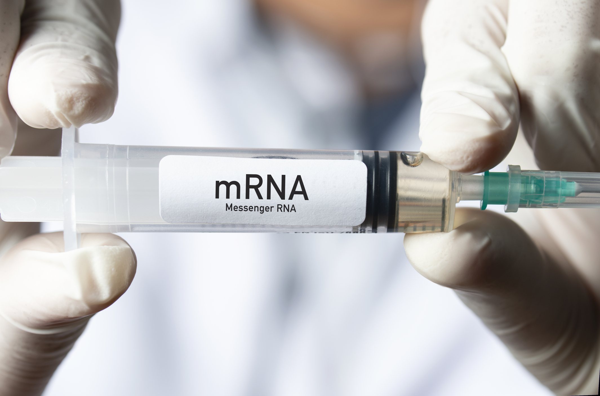

---
output:
  html_document:
    includes:
     after_body: "https://innoscape.de/general_stuff/footer.html"
    title: "mRNA-Tech"
    self_contained: false
    theme: null
    css: "https://innoscape.de/mRNA/style.css"
    highlight: null
    mathjax: null
---
<head>
<script async src="https://www.googletagmanager.com/gtag/js?id=UA-71167447-1"></script>

<script>
  window.dataLayer = window.dataLayer || [];
  function gtag(){dataLayer.push(arguments);}
  gtag('js', new Date());
  gtag('config', 'UA-71167447-1', { 'anonymize_ip': true });
</script>

<div class="container-fluid main-container">

<meta property='og:title' content='The rise of mRNA technology'/>
<meta property='og:image' content='https://innoscape.de/mRNA/mrna_pic.jpg'/>
<meta property='og:description' content='The pharma’s hottest new tech – mRNA, proved itself successful in battling Covid-19. It could be a cornerstone of medical treatments in the future. We investigate which R&D pharma hubs are driving the development of this technology.'/>
<meta property='og:url' content='https://innoscape.ch/en/publications/mrna-tech'/>
</head>
<!-- START with text -->

### **The rise of mRNA technology**

<br>

<p style="text-align: left; line-height: 100%;">
*October 2021* by <a href="#" data-placement="bottom" data-toggle="tooltip"  data-html="true" title="<b>Dragan Filimonovic</b> is a project collaborator and research associate at the <a href='https://cieb.unibas.ch' target = “_blank”>Center for International Economics and Business | CIEB</a>. He holds a PhD in Economics from the University of Basel and is specialized in applying methods for causal inference to evaluate public policies. Dragan is passionate about working with big data and is always in pursuit of finding creative solutions to interesting economic riddles.
<br>
<a href='https://www.linkedin.com/in/dragan-filimonovic-39303b47' target = “_blank”>LinkedIn</a> 
<br>
<a href='mailto:dragan.filimonovic@unibas.ch'>dragan.filimonovic@unibas.ch</a>">*Dragan Filimonovic*</a> *and* <a href="#" data-placement="bottom" data-toggle="tooltip"  data-html="true" title=" <b>Christian Rutzer</b> is the operational manager of the project and chief scientist of the <a href='https://cieb.unibas.ch' target = “_blank”>Center for International Economics and Business | CIEB</a>. He holds a PhD in Economics from the University of Basel in international trade and innovation. Christian likes to apply new methods from data science to analyze economic questions.
<br>
<a href='https://www.linkedin.com/in/christian-rutzer-38978392' target = “_blank”>LinkedIn</a> 
<br>
<a href='mailto:christian.rutzer@unibas.ch'>christian.rutzer@unibas.ch</a>">*Christian Rutzer*</a>
</p>

<p style="text-align: left; line-height: 150%;">
*Share this article:* 
&nbsp;
<a href='https://www.linkedin.com/sharing/share-offsite/?url=https://www.linkedin.com/feed/update/urn:li:activity:6857209327149690880/' class="fa fa-linkedin" style='color:black;text-decoration: none;' target='_blank'></a>
&nbsp;
<a href='https://twitter.com/cieb_unibas/status/1451443201412198401' class="fa fa-twitter" style='color:black;text-decoration: none;' target='_blank'></a>
</p>

 
{width=100%} 


<a href="https://iStock.com" target = "_blank">iStock.com/kemalbas</a> 


<br>

**The science of mRNA gained a lot of attention during the ongoing pandemic. Two mRNA vaccines have proven their efficacy against Covid-19 and for the first time in history this technology was used to battle a disease on a large scale. This important milestone could mean the beginning of a new era - the era of mRNA based medical treatments. In the following, we show how the technology has developed over time and which countries and companies play an important role.**  

<br>

As Figure 1 indicates, the rapid development and availability of the mRNA technology is manifested in an increasing number of patent applications relative to all pharma patent applications at the <a href="https://www.uspto.gov/" target ="blank">US patent office (USPTO)</a> in the past several years. 
<!--A look at the share of mRNA based patent applications in total pharma patent applications (on the world level) reveals that applied research in the field of mRNA started to evolve rapidly only in the past several years.-->

<details>
  <summary>*Click here to get a detailed description of how we detect mRNA-patents*</summary>
<embed src="https://drive.google.com/viewerng/
viewer?embedded=true&url=https://innoscape.de/mRNA/MRNA_Technology.pdf" width="100%" height="600">
</details>

<br>

<hr class="hr_red">
#### **Figure 1: Share of patent applications in the field of mRNA relative to pharmaceuticals is increasing**
```{r, echo=FALSE}
htmltools::includeHTML("plot_general.html")
```
<span style="font-size:0.8em">*Sources and notes: Own estimations of the <a href="https://www.cieb.unibas.ch" target ="blank">CIEB</a> using data on patent applications filed at the <a href="https://www.uspto.gov/" target ="blank">USPTO</a>. The data shown in the plot is available on <a href="https://github.com/ch54321/mrna_tech/blob/master/general_trend_mrna.csv" target ="blank">Github</a>.*</span>

<br>

But which research hubs are mainly responsible for developing this (possibly) breakthrough medical treatment technology of the future? In order to check which country-level pharma eco-systems are the most active ones in developing the mRNA technology, we plot the share of mRNA based patent applications in a country’s overall pharmaceutical patent applications filed at the <a href=https://www.patentsview.org target = “_blank”>USPTO</a>. 

<br>

<hr class="hr_red">
#### **Figure 2: Germany has a strong focus on mRNA based technologies**

<iframe width="100%" height="540" scrolling="no" frameBorder="0" style="overflow: hidden" src="https://innoscape.de/mRNA/plot_ctry.html" id="geo_plot">
<p>Your browser does not support iframes</p>
</iframe>
<span style="font-size:0.8em">*Sources and notes: Own estimations of the <a href="https://www.cieb.unibas.ch" target ="blank">CIEB</a> using data on patent applications filed at the <a href="https://www.uspto.gov/" target ="blank">USPTO</a>. The data shown in the plot is available on <a href="https://github.com/ch54321/mrna_tech/blob/master/ctry_trend_mrna.csv" target ="blank">Github</a>.*</span>

<br>

Three interesting conclusions may be drawn from Figure 2. First, the Western world drives the mRNA-patenting activity compared to big Asian research hubs. Second, until 2014, the USA had the largest (relative to domestic pharma patents) share of mRNA based patent applications at the <a href="https://www.uspto.gov/" target ="blank">USPTO</a> and third, since 2015, Germany’s pharmaceuticals have strongly profiled their pharma patent applications portfolio towards mRNA technology, becoming world-wide the industry that is most focused on developing and patenting mRNA based technologies. Nonetheless, the USA remains the most productive mRNA patenting hub where roughly 60% of all <a href="https://www.uspto.gov/" target ="blank">USPTO</a> mRNA patent applications are developed (see our second indicator: Share in total mRNA), however, Germany is rapidly catching up over the last three years.  

<div class=bloc_div>
<blockquote>***Germany’s pharmaceuticals have strongly focused on developing and patenting mRNA based technologies***</blockquote>
</div>

<br>

Finally, it is utterly important to identify and acknowledge the world’s leading pharmaceutical organizations in the field of mRNA technology. The following graph presents the 15 firms and universities with the largest number of filed mRNA patent applications at the <a href="https://www.uspto.gov/" target ="blank">USPTO</a>. 

<br>

<hr class="hr_red">
#### **Figure 3: Universities play a significant role in mRNA patents**
```{r, echo=FALSE}
htmltools::includeHTML("plot_firm.html")
```
<span style="font-size:0.8em">*Sources and notes: Own estimations of the <a href="https://www.cieb.unibas.ch" target ="blank">CIEB</a> using data on patent applications filed at the <a href="https://www.uspto.gov/" target ="blank">USPTO</a>. The data shown in the plot is available on <a href="https://github.com/ch54321/mrna_tech/blob/master/firm_mrna.csv" target ="blank">Github</a>.*</span>

<br>

The most patent applications have been made by Curevac and Moderna, both appeared as vaccine developers during the Covid-19 pandemic, even though only Moderna's ultimately got an approval. 

<div class=bloc_div>
<blockquote>***Universities are very active in mRNA-related patent applications***</blockquote>
</div>

Novartis takes a very high 3rd place which indicates that Swiss pharmacists possess a high scientific interest and know-how when it comes to mRNA research and development. Another very interesting observation is that universities are very active in mRNA-related patent applications, which highlights the importance of academic research for the emergence of new technologies.  

<br>

<div>
<iframe id="slider" width=100%" height="400" scrolling="no" frameBorder="0" style="overflow: hidden" src="https://innoscape.de/general_stuff/teaser/mrna_teaser.html">
</iframe>
</div>


<br class='br_desktop'>

<span style="font-size:0.8em">*This article was written using <a href = https://rmarkdown.rstudio.com/ target = “_blank”>R Markdown</a>, <a href=https://shiny.rstudio.com/ target = “_blank”>R shiny</a> and <a href=https://plotly.com/javascript/ target = “_blank”>Plotly</a>. Detection of mRNA-patents were performed at <a href = http://scicore.unibas.ch/ target = “_blank”> sciCORE </a> scientific computing center at the University of Basel. We thank Matthias Niggli for valuable feedback.*</span>

<br>
<br>

<script>
$(document).ready(function(){
  $('[data-toggle="tooltip"]').tooltip();   
});
</script>


