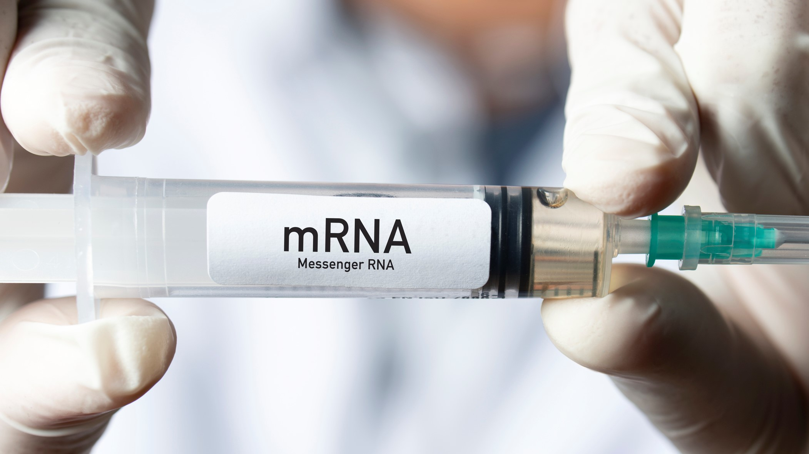

---
output:
  html_document:
    includes:
     after_body: "https://innoscape.de/general_stuff/footer.html"
    title: "mRNA-Tech"
    self_contained: false
    theme: null
    css: "https://innoscape.de/mRNA/style.css"
    highlight: null
    mathjax: null
---
<head>
<script async src="https://www.googletagmanager.com/gtag/js?id=UA-71167447-1"></script>

<script>
  window.dataLayer = window.dataLayer || [];
  function gtag(){dataLayer.push(arguments);}
  gtag('js', new Date());
  gtag('config', 'UA-71167447-1', { 'anonymize_ip': true });
</script>

<div class="container-fluid main-container">

<meta property='og:title' content='The rise of mRNA-technology'/>
<meta property='og:image' content='https://innoscape.de/internat_collab/title_new.jpg'/>
<meta property='og:description' content='As part of our #Innoscape Project, we investigate how partnering with different locations affects the quality of innovations. In short, collaborating with research sites in the USA and Great Britain has the greatest effect on the quality of innovation.'/>
<meta property='og:url' content='https://innoscape.ch/en/publications/international-rd'/>
</head>
<!-- START with text -->

### **The rise of mRNA-technology**

<br>

<p style="text-align: left; line-height: 100%;">
*October 2021* by <a href="#" data-placement="bottom" data-toggle="tooltip"  data-html="true" title="<b>Dragan Filimonovic</b> is a project collaborator and research associate at the <a href='https://cieb.unibas.ch' target = “_blank”>Center for International Economics and Business | CIEB</a>. He holds a PhD in Economics from the University of Basel and is specialized in applying methods for causal inference to evaluate public policies. Dragan is passionate about working with big data and is always in pursuit of finding creative solutions to interesting economic riddles.
<br>
<a href='https://www.linkedin.com/in/dragan-filimonovic-39303b47' target = “_blank”>LinkedIn</a> 
<br>
<a href='mailto:dragan.filimonovic@unibas.ch'>dragan.filimonovic@unibas.ch</a>">*Dragan Filimonovic*</a> *and* <a href="#" data-placement="bottom" data-toggle="tooltip"  data-html="true" title=" <b>Christian Rutzer</b> is the operational manager of the project and chief scientist of the <a href='https://cieb.unibas.ch' target = “_blank”>Center for International Economics and Business | CIEB</a>. He holds a PhD in Economics from the University of Basel in international trade and innovation. Christian likes to apply new methods from data science to analyze economic questions.
<br>
<a href='https://www.linkedin.com/in/christian-rutzer-38978392' target = “_blank”>LinkedIn</a> 
<br>
<a href='mailto:christian.rutzer@unibas.ch'>christian.rutzer@unibas.ch</a>">*Christian Rutzer*</a>
</p>

<!-- <p style="text-align: left; line-height: 150%;">
*Share this article:* 
&nbsp;
<a href='https://www.linkedin.com/sharing/share-offsite/?url=https://www.linkedin.com/feed/update/urn%3Ali%3Aactivity%3A6838804469455577088/?actorCompanyId=685023090' class="fa fa-linkedin" style='color:black;text-decoration: none;' target='_blank'></a>
&nbsp;
<a href='https://twitter.com/cieb_unibas/status/1433007915175235586' class="fa fa-twitter" style='color:black;text-decoration: none;' target='_blank'></a>
</p>
 -->
 
{width=100%} 


<br>

**The science of mRNA gained a lot of attention during the ongoing pandemic. Two mRNA vaccines have proven their efficacy against Covid-19 and for the first time in history this technology was used to battle a disease on a large scale. This important milestone could mean the beginning of a new era - the era of mRNA technology based medical treatments. The rapid development and availability of this technology is also manifested in the increasing number of patent-applications based on mRNA within the pharmaceutical sector.** 

<br>

A closer look at the share of mRNA based patents in total pharma patents (on the world level) reveals that the applied research started to evolve rapidly only in the past several years. Hence, it is very interesting to ask which research hubs are mainly responsible for developing this (possibly) breakthrough medical treatment technology of the future. 


<details>
  <summary>*Click here to get a detailed description of how we detect mRNA-patents*</summary>
<embed src="https://drive.google.com/viewerng/
viewer?embedded=true&url=https://innoscape.de/mRNA/MRNA_Technology.pdf" width="100%" height="600">
</details>

<br>

<hr class="hr_red">
#### **Figure 1: Number of patent applications in the field of mRNA is increasing**
```{r, echo=FALSE}
htmltools::includeHTML("plot_general.html")
```
<span style="font-size:0.8em">*Sources and notes: Own estimations of the CIEB based on data on patent applications filed at the <a href="https://www.uspto.gov/" target ="blank">USPTO</a>.*</span>

<br>

In order to check which country-level pharma eco-systems are the most active in producing mRNA technology related patents, we plot the share of mRNA based patents in the country’s total pharmaceutical patents applied at the <a href=https://www.patentsview.org target = “_blank”>USPTO</a>. 

<br>

<hr class="hr_red">
#### **Figure 2: Germany is becoming one of the leading mRNA-technology hubs**
```{r, echo=FALSE}
htmltools::includeHTML("plot_ctry.html")
```
<span style="font-size:0.8em">*Sources and notes: Own estimations of the CIEB based on data on patent applications filed at the <a href="https://www.uspto.gov/" target ="blank">USPTO</a>.*</span>

<br>

Three interesting conclusions may be drawn. First, the Western world drives the mRNA applied research compared to big Asian research hubs. Second, until 2014, the USA had the largest (relative) share of mRNA based patents in the world and third, since 2015, Germany’s pharmaceuticals have strongly emerged as new leaders in the field of mRNA, strongly focusing its attention to developing and patenting mRNA based technologies. Nonetheless, the USA remains the most productive mRNA patenting hub where roughly 60% of all mRNA based patents in the world are developed (see our second indicator: share of each country’s mRNA patents in the total number of mRNA patents in the world), however, Germany is rapidly catching up over the last three years.  

<div class=bloc_div>
<blockquote>***Germany’s pharmaceuticals have strongly emerged as new leaders in the field of mRNA***</blockquote>
</div>

<br>

Finally, it is utterly important to identify and acknowledge the world’s leading pharmaceutical organizations in the field of mRNA technology. The following graph presents the 15 firms and universities with the largest number of filed mRNA patents in the entire world. 

<br>

<hr class="hr_red">
#### **Figure 3: Universities play a significant role in mRNA patents.**
```{r, echo=FALSE}
htmltools::includeHTML("plot_firm.html")
```
<span style="font-size:0.8em">*Sources and notes: Own estimations of the CIEB based on data on patent applications filed at the <a href="https://www.uspto.gov/" target ="blank">USPTO</a>.*</span>

<br>

The most patent applications have been made by Curevac and Moderna, both appeared as vaccine developers during the Covid-19 pandemic, even though only Moderna's ultimately met the approval criteria. It is interesting to note that Biontech, the other major Covid-19 vaccine developer, is not among the 15 largest mRNA patent applicants. 

<div class=bloc_div>
<blockquote>***Universities are very active in patenting mRNA-innovations***</blockquote>
</div>

Novartis takes a very high 3th place which indicates that Swiss pharmacists possess a high scientific interest and know-how when it comes to mRNA research and development. Another very interesting observation is that universities are very active in patenting mRNA-innovations, which shows how crucial the role of academic research is for the emergence of new technologies.  

<br>

<span style="font-size:0.8em">*Source and notes: CIEB’s own calculations based on data from the <a href = https://www.patentsview.org target = “_blank”>USPTO</a>. A positive coefficient means that partnering with the respective country is associated with innovations of better quality than solely domestic innovations. A negative coefficient means the opposite. The horizontal bar plots show the corresponding 95% confidence interval. If the lower bound is above zero, the corresponding coefficient is significantly positive at the 95% level or higher. If the upper bound is below zero, the coefficient is significantly negative at the 95% level or higher.*</span>

<br>

<div>
<iframe id="slider" width=100%" height="400" scrolling="no" frameBorder="0" style="overflow: hidden" src="https://innoscape.de/general_stuff/teaser/mrna_teaser.html">
</iframe>
</div>


<br class='br_desktop'>

<span style="font-size:0.8em">*This article was written using <a href = https://rmarkdown.rstudio.com/ target = “_blank”>R Markdown</a>, <a href=https://shiny.rstudio.com/ target = “_blank”>R shiny</a> and <a href=https://plotly.com/javascript/ target = “_blank”>Plotly</a>. Detection of mRNA-patents were performed at <a href = http://scicore.unibas.ch/ target = “_blank”> sciCORE </a> scientific computing center at the University of Basel. We thank Matthias Niggli for valuable feedback.*</span>

<br>
<br>

<script>
$(document).ready(function(){
  $('[data-toggle="tooltip"]').tooltip();   
});
</script>


